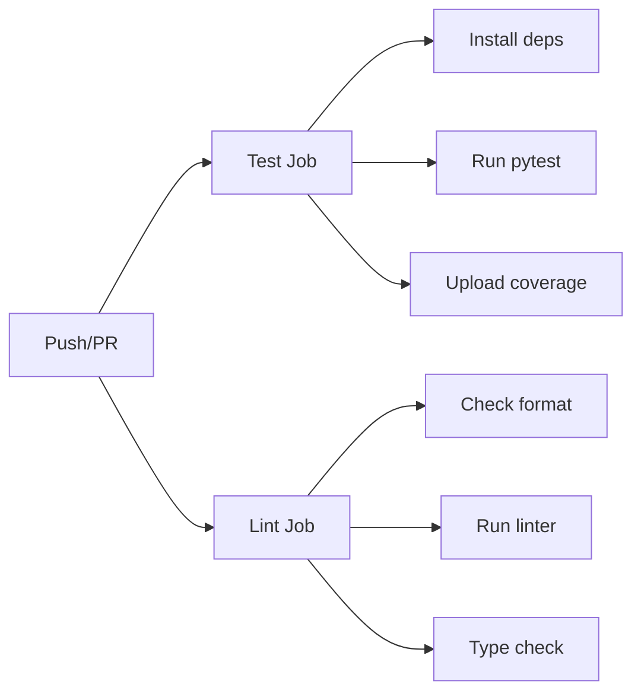

# Continuous Integration (CI)

This project uses GitHub Actions for automated testing and quality checks.

## What Gets Tested

Every push and pull request to `main` triggers:

### 1. **Test Suite** (`test` job)
- Runs all 66 tests
- Generates code coverage report
- Uploads coverage to Codecov (optional)
- Python version: 3.13

### 2. **Code Quality** (`lint` job)
- **Formatting**: `ruff format --check`
- **Linting**: `ruff check`
- **Type checking**: `mypy src/gmb`

## CI Workflow



## Configuration

The CI pipeline is defined in `.github/workflows/ci.yml`:

```yaml
# Triggers
on:
  push:
    branches: [ main ]
  pull_request:
    branches: [ main ]

# Jobs run in parallel
jobs:
  test:   # Runs tests with coverage
  lint:   # Checks code quality
```

## Running CI Checks Locally

Before pushing, run the same checks CI will run:

```bash
# Install dependencies
pip install -e ".[dev]"

# Run all checks
pytest                                    # Tests + coverage
ruff format --check .                     # Format check
ruff check .                              # Linting
mypy src/gmb --ignore-missing-imports     # Type check
```

## Status Badges

Add to your `README.md`:

```markdown

```

## Coverage Reporting

Coverage reports are uploaded to Codecov (optional):

1. **Enable Codecov**:
   - Sign up at https://codecov.io
   - Add your repository
   - Get your upload token

2. **Add Secret**:
   - Go to: Settings → Secrets → Actions
   - Add: `CODECOV_TOKEN` with your token value

3. **View Reports**:
   - Visit: https://codecov.io/gh/chris-nigh/gmb
   - See line-by-line coverage
   - Track coverage trends

## Interpreting Results

### ✅ Green Check = Success
All tests passed, code is formatted correctly, no linting errors, types check out.

### ❌ Red X = Failure
Click "Details" to see:
- Which test failed (test job)
- What formatting/lint issues exist (lint job)
- What type errors were found (lint job)

### ⚠️ Yellow Warning
Usually means:
- Codecov upload failed (non-critical)
- Cache miss (doesn't affect build)

## Troubleshooting

### Tests fail in CI but pass locally

**Different Python version:**
```bash
python --version  # Check you're using 3.13
```

**Missing dependencies:**
```bash
pip install -e ".[dev]"  # Install all dev deps
```

**Cached issues:**
```bash
pytest --cache-clear
rm -rf .pytest_cache __pycache__
```

### Linting fails

**Auto-fix most issues:**
```bash
ruff check --fix .
ruff format .
```

**See what's wrong:**
```bash
ruff check --output-format=github .
```

### Type checking fails

**Run locally with same settings:**
```bash
mypy src/gmb --ignore-missing-imports
```

**Common fixes:**
- Add type hints to function signatures
- Use `Any` for complex types
- Add `# type: ignore` for unavoidable issues

## Performance

The CI pipeline typically completes in:
- **Test job**: ~45-60 seconds
- **Lint job**: ~20-30 seconds
- **Total**: ~1-2 minutes

Caching speeds up subsequent runs by reusing installed packages.

## Best Practices

1. **Run checks before pushing**:
   ```bash
   pytest && ruff check . && mypy src/gmb --ignore-missing-imports
   ```

2. **Fix issues early**: Don't wait for CI to catch problems

3. **Keep tests fast**: 66 tests should run in < 2 seconds locally

4. **Maintain coverage**: Aim for >80% code coverage

5. **Write good commit messages**: CI failures are easier to debug with context

## Future Enhancements

Potential additions to the CI pipeline:

- **Performance testing**: Benchmark key operations
- **Security scanning**: Check for vulnerabilities
- **Dependency updates**: Automated Dependabot PRs
- **Release automation**: Auto-publish to PyPI on tags
- **Documentation builds**: Auto-deploy docs to GitHub Pages
